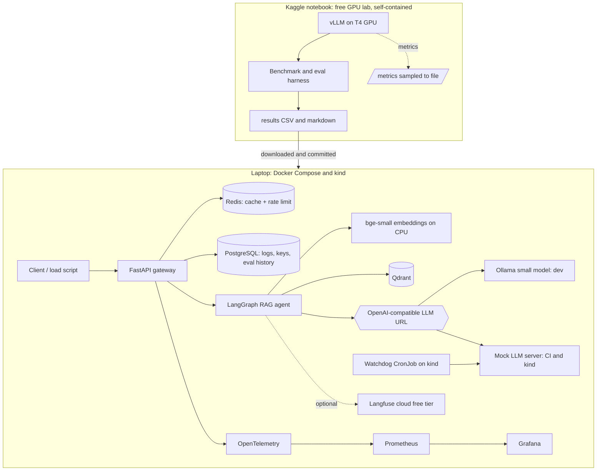

# FXAssist Lite: Architecture and Decision Log

A zero-cost LLM platform that answers questions over public forex/CFD documentation, built to learn and prove the skills in a Senior LLMOps / AI Platform Engineer job description.

This file has two audiences: Claude Code (as the design contract) and me (to understand why each choice was made). Every decision is written in plain language first, with the technical detail after.

Status: design v1. When a decision changes, add a new ADR and mark the old one "superseded". Never silently edit history.

---

## 1. Goals, constraints, non-goals

**Goal:** hands-on, demonstrable experience with: vLLM and self-hosted LLMs, Hugging Face models, GPU inference tuning, multi-GPU, Kubernetes, Helm, RAG, embeddings, Qdrant, LangGraph, Langfuse, OpenTelemetry, Prometheus, Grafana, Redis, PostgreSQL, CI/CD, reliability and production troubleshooting.

**Hard constraints**
- Total cost: **$0**. No paid cloud, no paid APIs, no credit card charges.
- Time box: about 5 to 7 focused days.
- Everything must be reproducible from the repo (scripts, not memory).
- Runs on my Windows laptop (use WSL2) plus a free GPU notebook.

**Non-goals:** production hardening, large models (13B+), fine-tuning, multi-region, real users, real money decisions.

**Honest limits of this project (say these in interviews):**
- GPU work happens on free T4 GPUs in a notebook, not on Kubernetes.
- Kubernetes work happens on kind (a local cluster) without a GPU.
- No EKS or AWS GPU experience is claimed from this project.

---

## 2. System overview

### Request flow (local stack)
1. Client calls `POST /v1/ask` with an API key.
2. Gateway validates the key, applies the rate limit, then checks the cache.
3. On a miss, the LangGraph agent runs: **retrieve, grade, generate with citations, or fall back to "not enough information"**.
4. The LLM call goes to an OpenAI-compatible URL (Ollama locally, mock in CI/kind).
5. The answer streams back (SSE). Logs go to Postgres, metrics to Prometheus, traces optionally to Langfuse.

### The GPU lab (Kaggle)
The notebook installs vLLM, downloads the model, runs the benchmark and evaluation **inside the same notebook**, and saves result files. I download them and commit them. The notebook never needs to be reachable from the internet.

---

## 3. Decision log

Each ADR: **Plain meaning**, **Context**, **Options**, **Decision**, **Consequences**.

### ADR-001: Domain is forex/CFD documentation Q&A
- **Plain meaning:** the chatbot answers questions from public broker and regulator documents.
- **Context:** need realistic RAG with free data, relevant to my fintech/quant background and the target employer.
- **Options:** generic PDF chatbot; code assistant; forex/CFD documentation.
- **Decision:** forex/CFD docs (public regulatory guidance, public product disclosure statements, glossary pages).
- **Consequences:** record each source and its licence in `data/SOURCES.md`; the bot must refuse personal trading or investment advice (see EDGE_CASES, area SAF).

### ADR-002: Zero-cost constraint and what it excludes
- **Plain meaning:** I pay nothing, so some skills are explicitly out of scope.
- **Decision:** use only free tiers and local resources. Exclude EKS, AWS GPU nodes, paid GPU rental.
- **Consequences:** EKS and GPU-on-Kubernetes are listed as "not proven". Kubernetes is proven on kind, GPU inference on Kaggle. The split is documented, not hidden.

### ADR-003: One OpenAI-compatible interface for every LLM
- **Plain meaning:** the app talks to one standard URL and doesn't care what is behind it.
- **Context:** the GPU is not always available, but everything must still be buildable and testable.
- **Options:** (a) call vLLM directly; (b) a mock only; (c) a standard interface with swappable backends.
- **Decision:** (c). Ollama for local development, a mock server for CI and kind, vLLM in the GPU lab.
- **Consequences:** local answer quality is not representative; only GPU-lab runs produce reported numbers. The mock must imitate streaming, errors and slowness, or tests are meaningless (EDGE_CASES, area LLM).

### ADR-004: GPU lab is a self-contained Kaggle notebook
- **Plain meaning:** borrow a free GPU for a few hours, run everything on it, bring back the results as files.
- **Context:** free GPU options are Kaggle (T4, including a 2-GPU option, weekly hour limit), Colab free (T4, less predictable), or a local GPU (none assumed).
- **Options:** expose the notebook to the internet with a tunnel and call it from my laptop; or run benchmark and eval entirely inside the notebook.
- **Decision:** run inside the notebook. A tunnel is optional, off by default, and only used if the platform terms allow it (check before using).
- **Why:** avoids terms-of-service risk and network flakiness, and makes results reproducible.
- **Consequences:** the notebook must save results incrementally because sessions can be killed; weekly GPU hours are limited, so every session needs a written plan; limits change, so verify them before relying on them.

### ADR-005: Model is Qwen2.5-3B-Instruct, in FP16 and AWQ
- **Plain meaning:** a small open model that fits on a T4 with room left for the KV cache (the memory the model uses to remember each request).
- **Context:** a T4 has 16GB and does not support bfloat16, so the data type must be float16. A larger model leaves less KV cache room.
- **Options:** Qwen2.5-3B, Qwen2.5-7B-AWQ, Llama (gated), Phi.
- **Decision:** Qwen2.5-3B-Instruct FP16 and its official AWQ 4-bit version, for a same-model precision comparison. Qwen2.5-7B-Instruct-AWQ is an optional stretch run.
- **Consequences:** verify exact repo names and licences at build time. Comparing different model sizes would not be a fair test, so don't.

### ADR-006: vLLM is the engine; T4 compatibility must be verified first
- **Plain meaning:** vLLM serves LLMs fast on GPUs; I must confirm the current version works on the older T4.
- **Context:** newer vLLM versions may change support for older GPU generations and attention backends. This is a known risk.
- **Decision:** pin a vLLM version after reading its docs for compute capability 7.5 (T4). If the latest doesn't work, pin an older compatible one and record why in `docs/VERSIONS.md`.
- **Stretch:** SGLang comparison if time and compatibility allow. Ollama is dev-only.
- **Consequences:** install vLLM in an isolated virtual environment in the notebook to avoid clashing with preinstalled libraries.

### ADR-007: LangGraph for agent flow; LangChain only for utilities
- **Plain meaning:** the agent is an explicit flowchart in code, so each step and fallback is visible in traces.
- **Decision:** LangGraph owns control flow; LangChain provides loaders and text splitters only.
- **Consequences:** pin versions; APIs change quickly.

### ADR-008: Qdrant for vector search
- **Plain meaning:** the database that finds the document chunks most similar to the question.
- **Options:** Qdrant, Milvus, pgvector.
- **Decision:** Qdrant in a container locally; its embedded local mode inside the Kaggle notebook (no server needed).
- **Why:** named in the JD, light on RAM; Milvus needs extra services; pgvector would not exercise the skill.

### ADR-009: Embeddings on CPU with bge-small
- **Plain meaning:** the model that turns text into numbers for similarity search runs on the CPU, keeping the GPU for the LLM.
- **Decision:** `BAAI/bge-small-en-v1.5` or equivalent.
- **Consequences:** CPU embedding latency shows up in traces; LLM benchmark numbers stay clean.

### ADR-010: Redis for cache and rate limiting, with an explicit failure policy
- **Plain meaning:** Redis remembers recent answers and counts requests per user.
- **Decision:** cache key = hash of normalized question + corpus version + prompt version + model name. Rate limit = token bucket per API key.
- **Failure policy:** if Redis is down, the **cache fails open** (skip it) and the **rate limiter falls back to a conservative in-memory limit**, so an outage can't allow unlimited traffic.
- **Consequences:** the cache must be switchable off for benchmarks; semantic caching is out of scope.

### ADR-011: PostgreSQL for logs, keys and eval history
- **Plain meaning:** a normal database for things that need to be queried later.
- **Decision:** hashed API keys, request log (no raw secrets), evaluation run results. Logging is non-blocking: a database failure must not fail a user request.

### ADR-012: Observability stack
- **Plain meaning:** the dashboards and traces that show what the system is doing.
- **Decision:** OpenTelemetry SDK in the gateway, metrics in Prometheus, dashboards in Grafana (JSON in the repo). Langfuse cloud free tier for LLM traces, optional via environment variable. In the GPU lab, vLLM's `/metrics` output is sampled to a file and charted offline.
- **Why not self-host Langfuse:** it needs several heavy backing services; the free cloud tier teaches the same instrumentation.
- **Consequences:** tracing must never break a request; metric labels stay low-cardinality (no user IDs or raw questions); never send secrets or personal data to traces.

### ADR-013: Kubernetes on kind, Helm for packaging
- **Plain meaning:** a Kubernetes cluster inside Docker on my laptop, with one Helm chart to deploy everything.
- **Decision:** kind plus a first-party Helm chart: probes, resource limits, a PodDisruptionBudget, config via ConfigMap and Secret.
- **Consequences:** no GPU scheduling is practised. This is stated plainly in the README and interview notes.

### ADR-014: Reliability design
- **Plain meaning:** the system should notice when the model stops working and recover by itself.
- **Decision:** `/healthz` (process alive), `/readyz` (dependencies reachable, including a tiny real LLM call with a timeout), startup/readiness/liveness probes, and a **canary watchdog CronJob** that sends a fixed prompt and triggers a rollout restart of the LLM deployment after N consecutive failures. On kind, the deployment it restarts is the mock LLM server standing in for vLLM.
- **Consequences:** the watchdog needs minimal RBAC (restart one named deployment only) and must have hysteresis (N failures plus a cooldown) to avoid restart loops.

### ADR-015: CI/CD with GitHub Actions
- **Decision:** on every PR: lint, tests, build images, `helm lint`/`helm template`, kind integration test with the mock LLM. Free on a public repo; no secrets needed, so fork PRs still pass.
- **Consequences:** nothing in CI depends on a GPU, Ollama or an external API.

### ADR-016: Evaluation is small, honest and repeatable
- **Decision:** 30 to 40 hand-written questions with expected source documents, including unanswerable and adversarial ones. Metrics: retrieval hit rate, citation correctness, abstention accuracy. No paid judge model.
- **Consequences:** report only GPU-lab results with the real model; include sample size and a caution about small samples.

### ADR-017: Benchmark methodology
- **Plain meaning:** measure fairly, or the numbers mean nothing.
- **Decision:** cache off; warm-up requests discarded; fixed prompt set and seed; at least 3 repetitions per cell; report p50 and p95; record time to first token, tokens per second, requests per second, GPU memory, error rate; note whether prefix caching was on. Change one variable at a time.
- **Matrix:** FP16 vs AWQ; concurrency 1, 4, 16, 32; short vs long (RAG-sized) prompts; knobs: GPU memory utilization, max concurrent sequences, max model length, prefix caching.
- **Consequences:** T4 results are not comparable to A100/H100 numbers; say so.

### ADR-018: Security and safety basics
- **Decision:** API keys hashed, secrets only in environment variables, none in git, containers run as non-root. Retrieved text is treated as untrusted (prompt injection). The bot declines personal trading/investment advice and labels answers as informational, with citations.
- **Consequences:** an adversarial test set is part of the evaluation.

### ADR-019: Windows development through WSL2
- **Plain meaning:** use Linux inside Windows so scripts and Makefiles behave like CI.
- **Decision:** develop in WSL2 with Docker Desktop integration; keep files in the Linux filesystem; enforce LF line endings.
- **Consequences:** if WSL2 is not possible, provide PowerShell equivalents of the Make targets.

### ADR-020: Documentation is a deliverable
- **Decision:** the repo must contain the full document set listed in the Claude Code prompt, kept in sync with the code. Each phase ends with a `LEARNING.md` update so I understand what was built.

### ADR-021: uv manages Python versions and the dependency lockfile
- **Status:** accepted in Phase 0 (2026-10-06). New decision; no earlier ADR covered tooling.
- **Plain meaning:** one tool installs the right Python, creates the virtual environment and writes a lockfile with the exact version and hash of every package, so my laptop, CI and Docker images all install the same thing.
- **Context:** the build contract asks for a pinned dependency lockfile and Python 3.11+. The repo will hold several services (gateway, agent, mock LLM, watchdog) that each need their own small dependency set for lean images.
- **Options:** (a) pip plus pip-tools `requirements.txt` files; (b) Poetry; (c) uv.
- **Decision:** (c) uv. It can install Python 3.11 itself, `uv lock --check` gives CI a one-line lockfile drift check (CI-03), and uv workspaces give each service its own `pyproject.toml` while sharing one `uv.lock`.
- **Consequences:** contributors need uv (`make bootstrap` checks for it and prints the install command). The repo root is a virtual workspace (`package = false`); services become workspace members from Phase 1. Dockerfiles in Phase 4 install from `uv.lock` with `uv sync --locked`.

### ADR-022: Ollama runs as a container in the compose stack, using the GPU when present
- **Status:** accepted at the start of Phase 1 (2026-10-06). Refines how ADR-003's "Ollama for local development" is run; the OpenAI-compatible interface is unchanged.
- **Plain meaning:** instead of installing Ollama on Windows or in Ubuntu, `make up` starts it as one more container, and `make pull-model` downloads the model into a Docker volume.
- **Context:** Ollama was not installed. Installed on Windows, WSL2 and containers cannot reliably reach it on `localhost` (NAT networking). The dev laptop has an NVIDIA RTX 3060 Laptop GPU (6 GB), and Docker Desktop passes it through to containers (checked with `nvidia-smi` in a container).
- **Options:** (a) Windows install; (b) native install in Ubuntu; (c) compose service.
- **Decision:** (c). Pinned `ollama/ollama` image wrapped in a two-line Dockerfile so it runs as a non-root user. GPU is added by an override file when `nvidia-smi` is found (`FXA_GPU=0` forces CPU). The service has its own profile (`llm`): `make up` includes it, `make up-lite` leaves it out for low-RAM machines.
- **Consequences:** reproducible from the repo with no manual install; containers reach it by service name and WSL2 at `localhost:11434`. Local answer quality is still not representative (Q4 quantised model); reported numbers come only from the GPU lab (ADR-003). Running the model on CPU needs about 3 GB more RAM than the lite budget.

### ADR-023: Embeddings run on ONNX Runtime through fastembed, not PyTorch
- **Status:** accepted at the start of Phase 1 (2026-10-06). Refines ADR-009 (which fixed the model, not the runtime).
- **Plain meaning:** the same bge-small model, run by a small, CPU-friendly engine instead of the large PyTorch library.
- **Context:** `sentence-transformers` pulls in PyTorch, which adds hundreds of MB (GBs with CUDA wheels) to every image that embeds text (the agent, later the gateway). ADR-009 wants embeddings on CPU only.
- **Options:** (a) sentence-transformers + PyTorch CPU wheels; (b) fastembed (Qdrant's library, ONNX Runtime); (c) a separate embedding server (e.g. Hugging Face TEI).
- **Decision:** (b) fastembed with `BAAI/bge-small-en-v1.5` (384 dimensions, cosine).
- **Consequences:** much smaller images and faster cold start. ONNX output can differ from PyTorch in the last decimals, so vectors must never be mixed across runtimes: the collection records the model name, runtime and dimension, and the agent refuses to start on a mismatch (DAT-10).

### ADR-024: The stream carries progress, then the validated answer; not raw tokens
- **Status:** proposed in Phase 2 (2026-10-06), implemented, awaiting approval. New decision: the build contract asks for SSE streaming, and no earlier ADR says what is streamed.
- **Plain meaning:** while the agent works, the client sees each step as it happens ("searching", "grading", "writing", "checking"). The answer text is sent once it has passed the citation and number checks, never word by word before that.
- **Context:** the validator (RET-03, RET-08, SAF-03) needs the whole answer: it removes sentences after the last citation, removes citations of excerpts that were not retrieved, and rejects answers with numbers not in the cited text. Text streamed before validation could show a user exactly what the validator later removes, such as an injected sentence or an invented leverage limit.
- **Options:** (a) stream raw tokens, then send a "final" event that replaces them; (b) validate sentence by sentence while streaming; (c) stream progress events, then the validated answer.
- **Decision:** (c). Events: `meta`, `status` (one per graph node), `answer` (validated text, citations, disclaimer), `done`, or `error`. Keep-alive comments every 10 s.
- **Consequences:** the user waits for the full generation before reading (about 1 to 2 s with the local 3B model), but sees progress immediately. Time to first token is still measured, inside the LLM adapter, so the metric is honest about the model (OBS-05). An error mid-generation becomes an `error` event (LLM-02). Option (a) can be added later behind a request flag if a use case accepts unvalidated drafts.

### ADR-025: API keys are checked against an in-memory snapshot of the key table
- **Status:** proposed in Phase 2 (2026-10-06), implemented, awaiting approval. Refines ADR-011 (keys live in PostgreSQL); the storage is unchanged.
- **Plain meaning:** the gateway copies the key table into memory every 30 seconds and checks keys there, so the database is not on the path of every request.
- **Context:** DEP-02 requires requests to keep working while PostgreSQL is down, but API-01 requires every request to be authenticated. Reading the key table per request would make PostgreSQL a hard dependency.
- **Options:** (a) query PostgreSQL per request; (b) per-key cache filled on first use; (c) full snapshot refreshed on a timer.
- **Decision:** (c). Keys are `fxa_<id>_<secret>`; only the id and a SHA-256 of the whole key are stored. A fast hash is enough because keys are 256-bit random values (slow hashes protect guessable human passwords). Comparison uses `hmac.compare_digest`, and unknown ids are compared against a dummy hash, so response timing does not reveal which ids exist.
- **Consequences:** a new or revoked key takes effect within one refresh interval (`FXA_KEY_REFRESH_S`, 30 s). The gateway cannot authenticate anyone until its first successful load, so it reports not-ready until then (DEP-04). The table is expected to stay small (hundreds of keys, not millions).

---

## 4. Cost model

| Item | Cost |
|---|---|
| Kaggle GPU notebook | $0 (weekly hour limit applies) |
| Colab free (backup) | $0 (availability varies) |
| Langfuse cloud free tier | $0 (optional) |
| Hugging Face models | $0 |
| GitHub, GitHub Actions (public repo), GHCR | $0 |
| Everything local (Docker, kind, Ollama, Qdrant, Redis, Postgres, Prometheus, Grafana) | $0 |
| **Total** | **$0** |

---

## 5. JD coverage and honesty matrix

| JD requirement | Status | Evidence |
|---|---|---|
| vLLM, Hugging Face, self-hosted LLM | Proven (T4) | `results/BENCHMARKS.md` |
| Inference optimization (latency, throughput, KV cache, concurrency) | Proven (T4) | benchmark matrix, tuning table |
| NVIDIA GPU performance | Partial: T4 only | memory and utilization notes |
| Multi-GPU | Partial: 2x T4 over PCIe, if available | `results/tensor_parallel.md` |
| Kubernetes, Docker, Helm | Proven on kind | Helm chart, kind e2e test |
| AWS / EKS | Not proven | stated in README |
| LLM reliability (health, recovery, restarts) | Proven on kind with a mock | watchdog, drills |
| Observability (Langfuse, OTel, Prometheus, Grafana) | Proven | dashboards, traces |
| RAG, embeddings, Qdrant | Proven | eval report |
| LangChain / LangGraph | Proven (LangGraph core, LangChain utilities) | graph code |
| SGLang, Ollama | Ollama: used. SGLang: stretch | notes |
| Redis, PostgreSQL | Proven | schema, cache metrics |
| CI/CD | Proven | workflows |
| Production troubleshooting | Partial: induced failures only | runbooks |

---

## 6. Glossary (for me)

- **Inference:** running a trained model to get answers.
- **vLLM:** a server that runs LLMs efficiently by batching requests and managing GPU memory.
- **KV cache:** memory holding what the model has already "read" for each request; it limits how many requests run at once.
- **Time to first token (TTFT):** delay before the first word appears; what users feel.
- **Throughput:** total tokens or requests handled per second.
- **Quantization (AWQ):** storing the model in fewer bits to save memory, usually with a small quality loss.
- **Tensor parallelism:** splitting one model across GPUs.
- **RAG:** retrieve relevant document chunks, then let the model answer using them.
- **Embedding:** a list of numbers representing the meaning of text.
- **Probe:** a check Kubernetes runs to decide if a container is alive or ready.
- **Helm chart:** a template package for deploying an app to Kubernetes.
- **Cardinality (metrics):** number of distinct label values; too many overwhelms Prometheus.

---

## 7. Risks and open questions

| Risk | Mitigation |
|---|---|
| vLLM version incompatible with T4 | verify first in a 10 minute test; pin an older version (ADR-006) |
| Kaggle weekly hours or features change | verify limits; keep a Colab fallback notebook |
| 2-GPU option unavailable or NCCL problems | document the attempt and the failure; run the single-GPU parts only |
| Session killed mid-benchmark | save results after every run; make runs resumable |
| Free tier terms change (Langfuse, others) | tracing optional; no hard dependency |
| Time overrun | follow the day plan; cut SGLang and the 7B stretch first |
| Licence issues with documents | record each source; keep corpus small; never commit restricted content |

Open questions to resolve during build: exact model repo names, pinned library versions, whether prefix caching helps this workload, whether AWQ quality loss shows up in the eval set.
