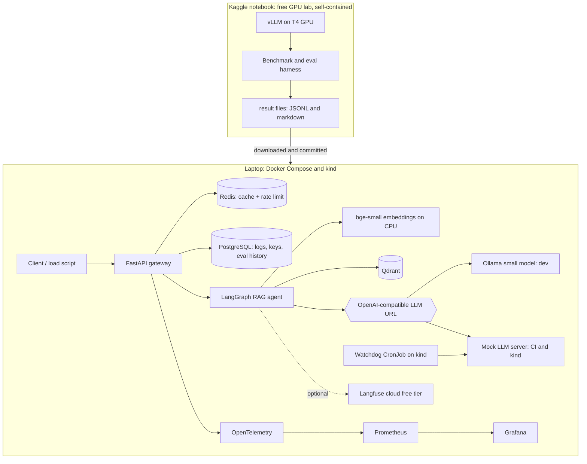

# FXAssist Lite

A zero-cost, self-hosted LLM platform that answers questions over public forex/CFD documentation, with citations. Built to learn and demonstrate LLMOps skills: vLLM serving and GPU tuning, RAG with Qdrant, LangGraph, observability, Kubernetes with Helm, and reliability engineering.

> **Status: all phases complete.** A FastAPI gateway serves cited answers from 26 public documents over SSE, with API keys, rate limiting, caching and tested failure handling for every dependency, plus Prometheus metrics, a Grafana dashboard, alert rules and OpenTelemetry traces. Runs locally with Docker Compose, and on a local kind cluster with a Helm chart, probes, an autoscaler and a canary watchdog. The GPU lab (vLLM 0.31.0 on free Kaggle T4s) has run: FP16 vs AWQ benchmarks, four tuning knobs, tensor parallel on two T4s, and the evaluation on both models. See [Results](#results).

## Honest limits

- **GPU work runs on free NVIDIA T4 GPUs in a Kaggle notebook**, not on Kubernetes.
- **Kubernetes work runs on kind (a local cluster) without a GPU.**
- **No EKS or AWS GPU experience is claimed** from this project.
- Local answers use a small Ollama model or a mock server; only GPU-lab runs produce reported numbers.
- Total spend is $0: no paid cloud, no paid APIs.

## Architecture



Design and every decision (ADR-001 to ADR-025): [ARCHITECTURE.md](ARCHITECTURE.md). Failure scenarios and their tests: [EDGE_CASES.md](EDGE_CASES.md).

## Quickstart

The project targets **WSL2 on Windows** (or native Linux). Commands below run inside the WSL2 Ubuntu shell.

### 1. One-time machine setup (Windows)

```powershell
# PowerShell
wsl --install -d Ubuntu-24.04
```

Then in Docker Desktop: **Settings > Resources > WSL integration**, enable Ubuntu-24.04.

### 2. Clone into the Linux filesystem

Keep the repo in your Linux home (`~`), not under `/mnt/c` and not in OneDrive: file access is much faster, and permissions and line endings behave.

```bash
cd ~
git clone <repo-url> fxassist_lite
cd fxassist_lite
```

### 3. Check prerequisites, install, run

```bash
make bootstrap      # checks everything, prints the exact fix for anything missing
make install        # creates .venv from uv.lock, installs the git hooks
cp .env.example .env
make demo           # whole stack with the mock LLM, ingest, an API key, four questions
make demo LLM=ollama   # the same with the real local model (downloads about 2 GB once)
```

Step by step instead:

```bash
make up             # Qdrant, Redis, PostgreSQL, gateway, mock LLM, Ollama (GPU if present),
                    # Prometheus (localhost:9090) and Grafana (localhost:3000)
make pull-model     # once: downloads qwen2.5:3b-instruct (about 2 GB) into Ollama
make ingest         # downloads the 26 documents, chunks, embeds and stores them (about 2 min)
make ask Q="What is negative balance protection?"   # the agent directly, no API
make api-key NAME=me                                # prints a key once; active within 30 s
curl -N localhost:8000/v1/ask -H "Authorization: Bearer fxa_..." \
     -d '{"question": "What is a margin call?"}'    # SSE: progress, then the answer
make drill          # stops Redis, PostgreSQL and Qdrant in turn and checks the gateway
make load           # a minute of mixed traffic: watch the Grafana dashboard move
make test           # offline tests: no Docker, network or model needed
make eval           # evaluation set against the local model
make down
```

### Web page

With the stack running (`make up`), open **http://localhost:8000/**. Create a key with `make api-key NAME=you` and paste it into the page (it stays in that browser tab; new keys work within 30 s). Ask a question, or attach a screenshot (button, paste or drag and drop): the text in it is read on the server with Tesseract, shown to you for editing, and sent with your question. The answer still comes only from the documents, with sources, and the same safety checks apply to text from images (ADR-027). Numbers in a screenshot are never accepted as facts, so with the small local model, questions about a screenshot are often answered cautiously or not at all.
### Kubernetes (kind)

```bash
make down           # free memory: kind runs its own copies of everything
make kind-up        # one-node cluster (own kubeconfig: ~/.kube/kind-fxassist) + metrics-server
make kind-deploy    # build and load images, create the Secret from .env, helm install, ingest (~5 min)
make kind-key       # an API key; the gateway is on http://127.0.0.1:8080
make kind-rbac-check kind-rollout-test kind-watchdog-drill   # the Phase 4 proofs
make kind-down
```

Chart and design: [deploy/helm/README.md](deploy/helm/README.md).

### GPU lab (Kaggle)

```bash
make lab-dry-run    # the whole notebook flow against the mock LLM, on the laptop
# then run notebooks/fxassist_gpu_lab.ipynb on Kaggle (docs/KAGGLE_PLAYBOOK.md) and:
make report RUN=results/raw/<date>/fxassist_results
```

API reference: [services/gateway/README.md](services/gateway/README.md). Metrics, dashboard, alerts and tracing: [observability/README.md](observability/README.md).

Example:

```
$ make ask Q="What is a pip?"
[answered, 1.2s]

A pip is a unit of change in an exchange rate of a currency pair. In foreign exchange markets
(forex), a pip is one unit of the fourth decimal place for dollar currencies, or one unit of the
second decimal place for the Japanese yen. [S1]

Sources:
  [S1] Wikipedia: Percentage in point
       https://en.wikipedia.org/wiki/Percentage_in_point

Informational only, not financial advice.
```

`make help` lists every target.

### Port conflicts

Every host port is set in `.env` (ENV-04). If one is taken, change it there. Example: a local PostgreSQL already on 5432:

```bash
FXA_POSTGRES_PORT=55432
```

Services are published on `127.0.0.1` only, so they are not reachable from your network.

### Memory (ENV-02)

| Profile | Starts | Docker memory |
|---|---|---|
| lite (`make up-lite`) | data stores, gateway and mock LLM (no real model) | 4 GiB minimum |
| mock (`make up-mock`) | lite plus Prometheus and Grafana, no model download | 4 GiB |
| default (`make up`) | everything: lite plus Ollama (the gateway uses it), Prometheus and Grafana. With an NVIDIA GPU the model sits in GPU memory; on CPU it needs about 3 GB more RAM | 4 GiB with a GPU, 7 GiB without |
| kind (`make kind-deploy`) | the whole stack inside a local Kubernetes cluster (stop compose first) | 4 GiB; measured 2026-10-07: 2.1 GiB for the whole kind node, of which 803 MiB are our pods |

Measured (2026-10-06/07): gateway 349 MiB, Grafana 217 MiB, Qdrant 94 to 184 MiB, Prometheus 59 MiB, PostgreSQL 48 MiB, mock LLM 45 MiB, Redis 13 MiB; about 825 MiB for everything except Ollama, which uses 2.1 GiB with the 3B model.
To give WSL2 more memory, add `[wsl2]` / `memory=8GB` to `%UserProfile%\.wslconfig`, then run `wsl --shutdown`.

## Project status

| Phase | Scope | Status |
|---|---|---|
| 0 | Scaffold, tooling, bootstrap, data-store compose, CI skeleton | Done |
| 1 | RAG core: ingestion, Qdrant, LangGraph agent, eval set | Done |
| 2 | FastAPI gateway, cache, rate limit, LLM adapter, mock LLM | Done |
| 3 | Observability: OpenTelemetry, Prometheus, Grafana, Langfuse | Done (Langfuse export configured but not tried against a real account) |
| 4 | Containers, Helm, kind, watchdog | Done |
| 5 | Full CI/CD, Kaggle notebooks, GPU playbook | Done; CI green on GitHub (github.com/chiragn28/FXAssist_Lite) |
| 6 | GPU session 1 (single T4) | Done 2026-10-07: [results/BENCHMARKS.md](results/BENCHMARKS.md), [results/EVAL_REPORT.md](results/EVAL_REPORT.md) |
| 7 | GPU session 2 (2x T4, tensor parallel) | Done 2026-10-07: [results/tensor_parallel.md](results/tensor_parallel.md) |
| 8 | Final documentation and evidence | Done |

## Results

Reported numbers come only from the GPU lab (Kaggle, Tesla T4, vLLM 0.31.0, Qwen2.5-3B-Instruct, 2026-10-07). Raw files are in [results/raw/](results/raw/).

| | FP16 | AWQ 4-bit |
|---|---|---|
| Throughput, short prompts, 32 users | 629 tokens/s | 1,094 tokens/s |
| Throughput, RAG-sized prompts, 32 users | 135 tokens/s | 144 tokens/s |
| KV cache on one T4 (utilisation 0.90) | 199,744 tokens | 300,496 tokens |
| Evaluation, 52 items | 46 passed | 42 passed |
| Safety and injection tests | 16/16 | 16/16 |
| Eval latency p50 / p95 | 3.5 s / 6.7 s | 1.5 s / 2.4 s |

- Tensor parallel on two T4s: 1.6x to 1.8x one GPU's throughput at 16 and 32 users, over PCIe without peer-to-peer ([results/tensor_parallel.md](results/tensor_parallel.md)).
- Prefix caching cut long-prompt time to first token from 3.30 s to 0.20 s, a best case (96% of prompt tokens were cached).
- Long first-token waits were prefill queueing, not memory: KV cache at most 21% full, 0 preemptions.
- Failed eval items were the model declining to answer, not invented answers. Small samples: one question moves a rate by about 4.5 points.

Full analysis and cautions: [results/BENCHMARKS.md](results/BENCHMARKS.md), [results/EVAL_REPORT.md](results/EVAL_REPORT.md). Local development runs with a 4-bit model are in [LEARNING.md](LEARNING.md) and are not results.

## What is tested

[EDGE_CASES.md](EDGE_CASES.md) lists 102 failure scenarios; each one has a test, a recorded drill, or a stated reason why it is still open. About 360 offline tests run with `make test` (no Docker, no model, no network beyond localhost). Drills against real services: `make drill` (Redis, PostgreSQL, Qdrant stopped one by one), the hanging-model drill (`docs/runbooks/llm-timeout-storm.md`), `make kind-rollout-test`, `make kind-watchdog-drill`, `make kind-rbac-check`, and a PostgreSQL disk-full drill. Still open: a pull request from a fork on GitHub (CI-02).

## Repository layout

| Path | What lives there |
|---|---|
| `services/gateway` | FastAPI API: auth, rate limit, cache, streaming (Phase 2) |
| `services/agent` | Ingestion and the LangGraph RAG agent (`fxassist` command) |
| `services/mock_llm` | Configurable fake OpenAI-compatible server (Phase 2) |
| `services/watchdog` | Canary CronJob that restarts a broken LLM deployment (Phase 4) |
| `deploy/compose` | Docker Compose for the local stack |
| `deploy/helm` | Helm chart for kind (Phase 4) |
| `observability/` | Prometheus config and Grafana dashboards (Phase 3) |
| `bench/` | Benchmark harness, GPU-lab orchestration, report generator |
| `notebooks/` | The Kaggle GPU-lab notebook and its builder |
| `eval/` | Evaluation questions, injection attacks and planted-excerpt scenarios |
| `data/` | `sources.yaml` corpus registry and generated `SOURCES.md`; raw documents are not committed |
| `scripts/` | Helper scripts, including `bootstrap.sh` |
| `docs/` | Versions, glossary, runbooks, playbooks, interview notes |
| `results/` | Real benchmark and eval output only |
| `tests/` | Repo-level tests |

## Documentation

| Document | What it is for |
|---|---|
| [ARCHITECTURE.md](ARCHITECTURE.md) | Design and decision log (ADR-001 to ADR-025) |
| [EDGE_CASES.md](EDGE_CASES.md) | Every failure scenario, with its test or drill |
| [LEARNING.md](LEARNING.md) | What each phase taught, in plain language, with interview questions |
| [docs/INTERVIEW_NOTES.md](docs/INTERVIEW_NOTES.md) | 1- and 5-minute explanations, trade-offs per ADR, honest limits, follow-up questions |
| [docs/DEMO_SCRIPT.md](docs/DEMO_SCRIPT.md) | A 3-minute demo |
| [docs/RESUME_BULLETS.md](docs/RESUME_BULLETS.md) | Resume bullets, numbers only from `results/` |
| [docs/KAGGLE_PLAYBOOK.md](docs/KAGGLE_PLAYBOOK.md) | GPU lab: verified facts, hour budget, recovery, GPU memory formula |
| [docs/BENCHMARK_METHOD.md](docs/BENCHMARK_METHOD.md) | How benchmark numbers are produced and read |
| [docs/runbooks/](docs/runbooks/) | One runbook per failure drill |
| [docs/VERSIONS.md](docs/VERSIONS.md) | Every pinned version and how it was verified |
| [docs/GLOSSARY.md](docs/GLOSSARY.md) | Plain-language definitions |
| [docs/TRADING_TERMS.md](docs/TRADING_TERMS.md) | Forex and CFD vocabulary: pips, lots, margin, stop out, execution models, regulation |
| [docs/INTERVIEW_QA.md](docs/INTERVIEW_QA.md) | 88 interview questions with answers grounded in this repo |
| [data/SOURCES.md](data/SOURCES.md) | The 26 documents, their licences and whether they may be redistributed |
| [CHANGELOG.md](CHANGELOG.md) | Changes per phase |
